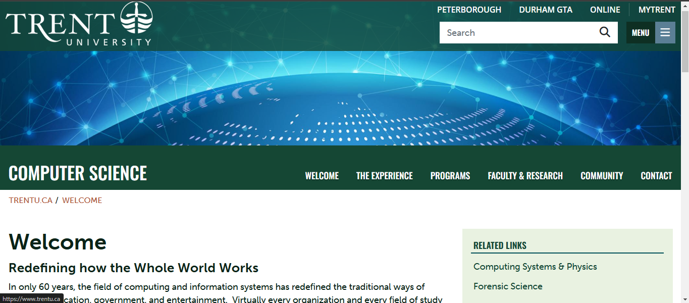

# Workshop-4

By: Shalimar Alkayid

# Emphasis

In only 60 years, the field of *computing and information systems* has redefined the traditional ways of business, education, government, and entertainment.  Virtually every organization and every field of study rely on computers and related technologies to succeed in the _Information Age_.  Even our everyday vocabulary embraces words like The Internet, email, Google, Facebook, YouTube, MP3, ATM, and Wii.


## Strong

The study of **computing and information systems** is central to our understanding of how the world processes, manages and communicates information using digital technologies.  As a student, you learn to build and use __computing and information systems__.  You learn to see things from a broader systems perspective and to develop integrated solutions that meet the needs of your users.  And you learn to appreciate the far-reaching cultural, ethical, and legal impact of digital systems.

## Lists

### Unordered Lists

- List item 1
- List item 2
    - sub item 
    - sub item 2 
- List item 3


### Ordered Lists
1. First item
2. Second item
    1. Sub item 1
    2. sub item 2
3. Third item

## Images




## HyperLinks
[COIS Department Website](https://www.trentu.ca/cois/)


## Including code

### Inline 

In HTML the `img` tage is used to display pictures

### Code fences

```html
 <nav>
        <ul>
          <li><a href="index.html">Home</a></li>
          <li><a href="grid.html">Grid</a></li>
          <li><a href="https://trentu.ca">Trent</a></li>
          <li><a href="https://loki.trentu.ca">Loki</a></li>
        </ul>
</nav>
```

```css
body {
  font-family: system-ui, -apple-system,  BlinkMacSystemFont, "Segoe UI", Roboto,
    Oxygen, Ubuntu, Cantarell, "Open Sans", "Helvetica Neue", sans-serif;
  height: 100vh;
  display: flex;
  flex-direction: column;
}

```